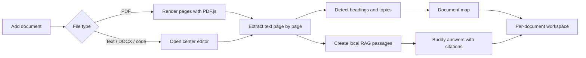
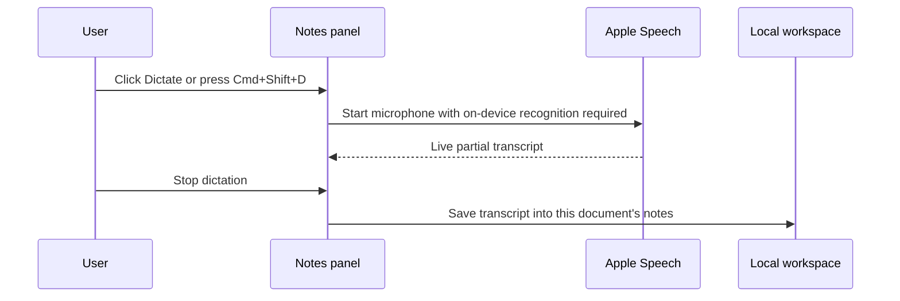

# StudyBuddy — visual product and workflow report

StudyBuddy is a local-first reading workspace. Every document owns its reader state, map, Buddy conversation, notes, highlights, and retrieval index.

## The workspace

```text
┌──────────────────┬────────────────────────────┬──────────────────┐
│ DOCUMENT MAP     │ READER / EDITOR            │ BUDDY  |  NOTES  │
│                  │                            │                  │
│ Chapters         │ PDF pages                  │ Grounded chat    │
│ Topics           │ or editable text/code      │ Markdown/LaTeX   │
│ Direct navigation│                            │ Dictation/export │
└──────────────────┴────────────────────────────┴──────────────────┘
```

- Left: locally detected chapters, headings, and topics.
- Center: PDF.js reader for PDFs; local editor for DOCX text, TXT, Markdown, and code.
- Right: Buddy answers questions from the active document, while Notes stores the user’s own work.

The website and Mac app render the same Vite interface. The Mac wrapper adds window vibrancy, native menus, reliable PDF export, Ollama bridging, and Apple Speech.

## What happens after upload



The raw file is stored in IndexedDB. Notes and workspace state are stored separately by document ID, preventing content from one book appearing in another workspace.

## Local RAG in plain language

1. Text is divided into overlapping passages.
2. StudyBuddy builds a local term index.
3. A question retrieves the most relevant passages.
4. The selected passages—not the entire library—are sent to the chosen generator.
5. Buddy answers with page or passage citations.

With no AI model, StudyBuddy still returns retrieved passages. Ollama can generate the answer locally. Gemini and OpenAI-compatible APIs are optional and receive only the question and retrieved context required for that request.

## Apple Speech notes flow



The Mac app uses `SFSpeechRecognizer`, requires on-device recognition, and never routes microphone audio through Ollama, Firebase, or a StudyBuddy server. Apple documents that setting `requiresOnDeviceRecognition` prevents the request from sending audio over the network: [Apple documentation](https://developer.apple.com/documentation/speech/sfspeechrecognitionrequest/requiresondevicerecognition).

The compiled helper is approximately 91 KB. It uses the speech model already managed by macOS, so the downloadable app size changes by less than 0.1 MB.

## Notes and export

- Markdown, quotations, lists, code, and LaTeX equations.
- Typeset or handwriting-style preview and PDF output.
- Compact three-column cheat-sheet PDF.
- TXT and Word-compatible export.
- Speech-to-text inserts personal thoughts at the current cursor.
- Native Mac PDF Save dialog.

## Local and cloud boundary

| Capability | Local Only | Cloud enabled |
|---|---|---|
| Files, reading state, notes, highlights | On the Mac | Also synchronized privately with Firebase |
| Document map and lexical RAG | On the Mac | Rebuilt locally on each device |
| Apple Speech microphone audio | On the Mac | Never uploaded by StudyBuddy |
| Ollama generation | On the Mac | On the Mac |
| Gemini/OpenAI-compatible generation | Not used | Retrieved context sent only when selected |

Cloud synchronization is disabled for the current release. Apple or Google sign-in supplies an optional profile identity only; signing in does not upload, download, merge, or remove any workspace data. Authentication itself requires internet access, while documents, notes, chats, highlights, progress, and RAG indexes stay local.

## Editions and downloads

| Edition | File | Purpose |
|---|---|---|
| Website | `StudyBuddy-1.0.1-Website.zip` | Hosting and rapid UI development |
| Standard Mac | `StudyBuddy-1.0.1-arm64.dmg` | Small Mac app; connect an existing model or optional cloud provider |
| Portable Mac | `StudyBuddy-1.0.1-arm64-mac.zip` | App archive without DMG installation |
| Complete Offline | `StudyBuddy-1.0.1-Compact-Offline-arm64.dmg` | App, Ollama, and multimodal Gemma 3 4B |

## Main technologies

| Technology | Why it exists |
|---|---|
| Vite | Shared website production build and live development |
| Electron | Mac window, menus, local bridge, packaging, and native PDF export |
| PDF.js | PDF rendering, selectable text, page extraction, and highlights |
| IndexedDB | Large local documents and derived indexes |
| Firebase Authentication | Optional Apple or Google profile identity; cloud document storage and workspace sync are disabled |
| Ollama + Gemma 3 4B | Optional fully local multimodal answer generation |
| KaTeX | Offline mathematical typesetting |
| Apple Speech | Private on-device speech-to-text for personal notes |

## Product status

The website, standard Mac app, and offline Mac app use the same frontend. Release builds are assembled outside File Provider storage, receive a complete nested signature, and are verified again from inside the finished DMG. The remaining warning-free public-distribution requirement is Developer ID signing and Apple notarization.
