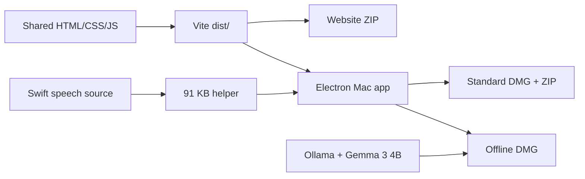

# StudyBuddy code guide — beginner-friendly

This guide explains where the important code lives, what it does, and where to make common changes.

## Project map

```text
Study Buddy/
├── index.html                    UI structure and dialogs
├── src/
│   ├── main.js                   reader, workspaces, RAG, notes, AI, dictation UI
│   ├── style.css                 complete website and Mac visual system
│   ├── notes-export.js           Markdown/LaTeX and polished PDF layout
│   └── firebase.js               optional Apple/Google profile authentication
├── electron/
│   ├── main.cjs                  Mac window, IPC, Ollama, PDF export, speech process
│   └── preload.cjs               safe bridge from the webpage to Electron
├── native/
│   └── StudyBuddySpeech.swift    Apple on-device speech recognition
├── scripts/
│   ├── build-speech-helper.sh    compiles the 91 KB Swift helper
│   ├── release-both.sh           builds website and standard Mac releases
│   └── build-offline-dmg.sh      creates the Ollama + Gemma offline DMG
├── public/                       app icon and public assets
├── build/                        generated icon and native build inputs
├── dist/                         Vite production website
└── release/                      downloadable ZIP and DMG files
```

## 1. `index.html`: the visible structure

Think of this file as the skeleton.

- Header: home, reader controls, workspace menu, account, and settings.
- Document map: chapter/topic navigation.
- Center panel: library, PDF reader, or editable document.
- Workspace panel: Buddy and Notes tabs.
- Notes toolbar: formatting, Apple dictation, style, cheat sheet, and exports.
- Dialogs: AI provider settings, local profile, and selection actions.

Change text, add buttons, or rearrange panels here. Behavior normally belongs in `src/main.js`, not inline HTML.

## 2. `src/style.css`: appearance

This contains the matte-black/crimson theme, liquid-glass panels, responsive layout, animations, custom dropdowns, PDF selection actions, and dictation pulse.

Useful search terms:

- `.document-outline` — left pane.
- `.pdf-viewer-panel` — center pane.
- `.workspace-panel` — Buddy/Notes pane.
- `.liquid-select` — black-and-white dropdown system.
- `.dictation-button` — microphone states.
- `html.native-app` — styling only applied inside Electron.

Prefer editing shared rules first. Use `html.native-app` only when macOS needs a genuinely different treatment.

## 3. `src/main.js`: application behavior

This is the main controller and is organized by feature sections.

### Document library

`openDB`, `saveLibraryDocument`, and `renderLibrary` store and display files in IndexedDB. `openLibraryDocument` restores the selected document’s own session before opening it.

### PDF reader

`loadPdfDoc` loads PDF.js. It creates page containers first, then `IntersectionObserver` renders only nearby pages. This keeps long PDFs responsive. The text layer enables selection and highlights.

### Editable documents

`openTextDocument` places text-like documents in the center editor. `saveTextDocumentChanges` persists the edited local copy. `buildTextDocumentOutline` turns headings into sidebar navigation.

### Document map

Local analysis detects likely chapters and headings from typography and text patterns. Optional AI refinement receives only the local outline candidates and a limited excerpt.

### RAG

`initializeLocalRag` and `initializeTextRag` split document text into overlapping passages. `retrieveDocumentContext` ranks passages with a BM25-style lexical score and optionally combines local embeddings when an embedding model exists.

`buildRagPrompt` places only the retrieved passages into the generation prompt. This is why Buddy stays grounded in the currently open document.

### AI providers

- `fetchOllamaAPI` calls the local Ollama bridge.
- `fetchGeminiAPI` calls Gemini when the user explicitly selects it.
- `fetchOpenAICompatibleAPI` supports compatible `/chat/completions` endpoints.
- Demo mode shows local retrieval without requiring a model.

### Notes

`initNotesEditor` handles Markdown editing, preview, local file connection, and exports. Every edit calls local persistence first; cloud saving is separately debounced.

### Speech-to-text

`initNotesDictation` controls the microphone button. It remembers the note cursor, receives partial text, updates the editor live, and saves the final thought into the active document’s notes.

It never accesses the microphone directly from webpage JavaScript. It calls the restricted Electron bridge instead.

## 4. `src/notes-export.js`: document generation

`convertMarkdownToHtml` converts supported Markdown and KaTeX expressions into safe export markup. `buildNotesExportDocument` creates either:

- portrait reading notes;
- ruled handwriting notes; or
- a landscape three-column cheat sheet.

Electron loads this HTML invisibly and prints it to PDF.

## 5. Electron: the Mac bridge

### `electron/preload.cjs`

Electron uses context isolation. The webpage cannot use Node.js directly. The preload exposes only named safe operations such as:

- `ollamaFetch`;
- `exportNotesPdf`;
- `startSpeech` and `stopSpeech`; and
- native menu commands.

This limited bridge reduces the impact of unsafe webpage code.

### `electron/main.cjs`

The main process:

- serves the bundled Vite files on a private loopback port;
- creates the native window and menu;
- proxies Ollama requests to `127.0.0.1:11434`;
- renders polished PDFs through an invisible window;
- starts and stops the Apple Speech helper; and
- forwards live transcript events to the Notes UI.

## 6. `native/StudyBuddySpeech.swift`: private dictation

The helper uses `AVAudioEngine` to capture microphone buffers and `SFSpeechRecognizer` to transcribe them.

Important safeguards:

- checks that the language supports on-device recognition;
- sets `requiresOnDeviceRecognition = true`;
- sends small JSON events through standard output;
- does not contain networking code; and
- exits when dictation stops.

The source is compiled by `scripts/build-speech-helper.sh`. Apple’s frameworks remain part of macOS, so only the small executable is bundled.

## 7. Firebase and privacy

`src/firebase.js` initializes Firebase Authentication for optional Apple or Google identity. In the current release, `cloudSyncEnabled` is fixed to `false`: signing in never calls the upload, download, merge, or cloud-session paths. Files, notes, chats, highlights, and the RAG index remain local. The dormant sync helpers are retained for a later explicitly opt-in encrypted sync design.

Never place secret administrator credentials in frontend code. User API keys are currently local preferences; a production release should move sensitive credentials into macOS Keychain.

## 8. Build pipeline



Development commands:

```bash
npm run dev:web        # Live website
npm run build:web      # Production website
npm run build:speech   # Compile Apple Speech helper
npm run release:both   # Website + standard Mac downloads
npm run build:offline-lite
```

## 9. Common beginner changes

| Goal | Start here |
|---|---|
| Change colors or glass effects | `src/style.css` variables and final theme sections |
| Change the library or panels | `index.html` and `renderLibrary` |
| Add a Buddy command | `runAICommand` in `src/main.js` |
| Change retrieval behavior | `chunkPageText` and `retrieveDocumentContext` |
| Add a note export format | `src/notes-export.js` and the Notes export handlers |
| Change dictation vocabulary | `contextualStrings` in `StudyBuddySpeech.swift` |
| Add a new native feature | IPC handler in `main.cjs`, safe method in `preload.cjs`, then UI call in `main.js` |

## 10. Practical rules

1. Keep document data separated by `activeDocumentId`.
2. Save locally before attempting cloud sync.
3. Never send an entire library to an AI provider.
4. Keep native operations behind the preload bridge.
5. Test changes on the website, then package the same `dist/` for Mac.
6. Rebuild the Swift helper whenever `StudyBuddySpeech.swift` changes.
