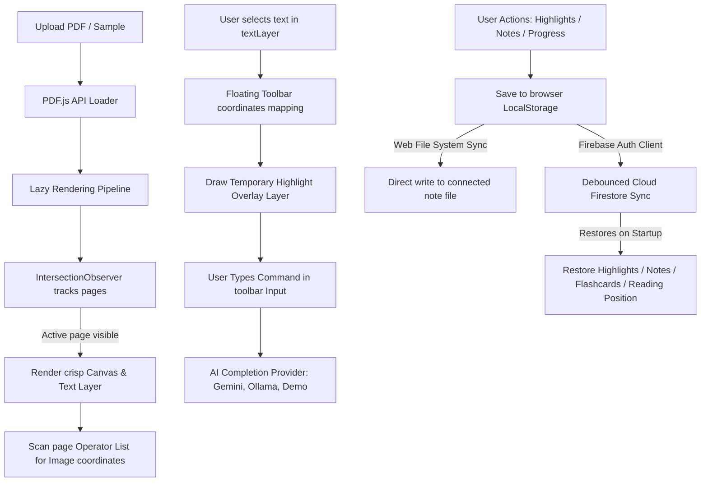

# Study — Interactive PDF Reader & AI Companion

A modern, highly interactive PDF viewer and AI study companion designed to enhance document reading, note-taking, and studying.

---

## 1. How the Application Works (System Workings)

The "Study" workspace is designed as a split-pane, high-performance web dashboard. The left column contains the PDF rendering pipeline, and the right column houses the interactive study tabs (AI Chat, Notes, Flashcards).

### A. Left Column: PDF Renderer & Image Detection
- **Lazy Rendering & High-DPI Support**: When a PDF is loaded, container divs are created for every page to set scroll heights. As pages enter the viewport, an `IntersectionObserver` initiates dynamic rendering. To prevent pixelated text or diagrams on modern screens, the page is rendered using a canvas multiplier scale matching the device's pixel ratio (`window.devicePixelRatio`).
- **PDF Text Selection Layer**: PDF.js generates invisible text spans on top of the rendered canvas. This allows users to select text naturally using standard browser dragging.
- **Image Bounding Box Extraction**: During page rendering, the application executes `page.getOperatorList()`. It traverses the stream of PDF layout paint commands (checking for `paintImageXObject`, `paintInlineImageXObject`, and `paintImageMaskXObject`). By tracking coordinate transformation matrices (`transform` operators) and multiplying them, it resolves the exact coordinates of images in scale 1.0 page coordinates, caching them for overlap checks.

### B. Floating Actions Box (Interactive Siri Glow)
- **Position Tracking**: The toolbar uses client selection range dimensions (`getBoundingClientRect()`) to compute horizontal offsets and vertical positions, ensuring it floats directly above the highlighted text block.
- **Typing Guard (Focus Fix)**: In standard browsers, focusing an input box clears the active document selection. To allow users to type `/summarize` or `/keypoints` without the toolbar disappearing, the system uses a **temporary highlight overlay**. When a selection is made, visual highlight spans (`.highlight-span.temporary`) are appended directly to a highlight overlay layer. If the input field is focused, the browser selection clears, but the listener returns early—preserving the visual highlights on the document.
- **Auto Image Copy**: On selection completion (`mouseup` or `keyup`), the selection coordinates are translated to scale 1.0 page coordinates and tested against cached image locations. If there's an intersection, the image is cropped from the canvas and copied to the user's clipboard.

### C. Workspace & AI Providers
- **Prompt Split Routing**:
  - `/summarize`: Returns a single, concise paragraph with no lists or headers.
  - `/keypoints`: Returns key takeaways and terms as a structured bulleted list.
  - `/explain`: Returns clear analogical explanations.
  - `/flashcard`: Returns raw JSON structures parsed into a flipping flashcards study deck.
- **AI Completion Clients**:
  - *Google Gemini*: Triggers browser-safe direct HTTPS completions using a user's API Key.
  - *Ollama (Local)*: Queries a local Ollama server running locally on port `11434`. A local proxy is configured in Vite (`/api/ollama`) to bypass CORS blocks.
  - *Demo Mode*: Provides high-fidelity, keyword-enriched simulated completions if offline.

### D. Study Notes Sync & Export
- **File System Access API Sync**: Clicking "Connect File" invokes `window.showOpenFilePicker()`. When text is highlighted or summaries are generated, a writable file stream is created to append notes directly to the disk file without standard download prompts.
- **Manual Export Options**:
  - **TXT**: Plain-text downloader.
  - **DOCX**: Formats note markdown into an HTML body template and downloads it as a `.doc` file under `application/msword`. Microsoft Word and Google Docs read this HTML formatting natively.
  - **PDF**: Compiles notes into print-ready styling, opens a pop-up window, triggers `window.print()` for PDF exporting, and self-closes.

### E. Cloud Synchronization & Session Recovery (Firebase Sync)
- **Automatic Anonymous Guest Authentication**: When the application starts, it performs a frictionless behind-the-scenes anonymous authentication via Firebase Auth to establish a secure workspace instance.
- **Google Sign-In Account Upgrade**: Users can click the account button in the header to upgrade their guest session to a persistent Google account, syncing study assets and progress to their personal profile.
- **Cloud State Backups**: User states (highlights, notes editor text, flashcards deck, active page scroll position, and PDF zoom levels) are automatically backed up to Cloud Firestore under `/users/{uid}/data/session`.
- **Debounced Save Loop**: Notes, scroll coordinates, and configurations trigger a debounced saving routine (`1000ms` window) to minimize write bandwidth and keep the client snappy.
- **Auto-Restoration on Startup**: Re-authenticating a user profile pulls their document from Firestore and automatically redraws overlay elements, populates the editor, and scrolls the reader panel back to where they stopped.

---

## 2. Technical Tools & Web APIs Used

| Tool/API | Usage in Project |
| :--- | :--- |
| **Vite v5.4.11** | High-performance bundler and local development server, providing live reload and API proxy routing. |
| **PDF.js v3.11.174** | Firefox's open-source library used to load documents, render page canvases, extract textLayers, and scan image operator matrices. |
| **Firebase Client SDK v10.x** | Integrates Firebase Auth (Anonymous & Google Login) and Cloud Firestore for session storage and synchronization. |
| **HTML5 & CSS3** | Structural elements and premium dark-mode glassmorphic theme styling. |
| **Canvas API** | Used to draw high-resolution page bitmaps and crop selected image coordinate bounds for export. |
| **Web File System Access API** | Modern browser file picker handles (`showOpenFilePicker`), allowing live notes synchronization directly to files on disk. |
| **Clipboard API** | Used to write binary PNG data (`ClipboardItem`) directly to the system clipboard. |
| **IntersectionObserver API** | Used to lazy-load PDF canvases, optimizing performance and browser memory. |

---

## 3. Operational Setup & Usage Checklist

Follow this checklist to get the application set up and make use of all its features:

### Step 1: Install & Launch the Server
1. **Install dependencies**: Run `npm install` in the project root directory.
2. **Run dev server**: Start the dev environment using `npm run dev`.
3. **Open the application**: Navigate to `http://localhost:5173/` in your browser.

### Step 2: Configure AI Providers
- **For Google Gemini Cloud API**:
  1. Obtain a free API key from the [Google AI Studio](https://aistudio.google.com/).
  2. In the Study application, click **API Key** in the top right header.
  3. Set provider to **Google Gemini (Cloud)**, paste your key, and click **Save Changes**.
- **For Local Gemma Model (Ollama)**:
  1. Install [Ollama](https://ollama.com/) on your computer.
  2. Pull the Gemma model: Run `ollama pull gemma` in your terminal.
  3. Ensure the Ollama app is running in the background.
  4. In the Study application settings dialog, choose **Ollama (Local Model)**.
  5. Click **Scan** to check connection and load available models (select `gemma` or similar), and click **Save Changes**.

### Step 3: Connect Your Study Notes File
1. Create an empty `.txt` or `.md` file on your computer (e.g., `study_notes.txt`).
2. In the app, switch to the **Study Notes** tab on the right workspace panel.
3. Click the **Connect File** button inside the header card.
4. Choose the empty file you created. Your browser will prompt you to grant edit permissions—click **Save Changes / Allow**.
5. Note the status dot turns green (`SYNC ACTIVE`), showing it's ready.

### Step 4: Configure Firebase Cloud Synchronization & Session Recovery
1. When you first launch the app, you will be automatically signed in under a **Guest Session** (Anonymous Auth).
2. Look at the top right header widget showing `👤 Guest Session`. This indicates that your highlights, notes, and session state are backed up locally.
3. Click the `👤 Guest Session` button in the header.
4. In the cloud sync modal, click **Sign In with Google**. A popup window will prompt you to authenticate.
5. Once signed in, the header status will update to display your Google avatar and name, and the badge will show `Cloud Sync Active`.
6. Now, any updates you make will synchronize to Cloud Firestore, enabling you to close the browser and resume exactly where you left off (including notes text, highlights, flashcard decks, current reading page, and zoom level).

### Step 5: Highlight and Run Commands
1. Upload a PDF or click **Load Sample Document** on the welcome page.
2. Drag your cursor to select a sentence.
3. Notice the floating actions box appears above your selection:
   - Click a **color circle** to add a persistent highlight to your PDF.
   - Click the **Note** button to append the selected text directly to your local file.
   - Click the **Summarize** button to get a paragraph summary inside the Siri-glow pop-up.
   - Click inside the text box and type `/keypoints` to get bullet-point takeaways.
   - Type `/flashcard` to generate study cards, then view and practice them under the **Flashcards** tab.
4. Drag your selection over a diagram/image in the PDF. Verify that a toast message pops up confirming the crop was automatically copied to your clipboard.

### Step 6: Exporting Notes
1. Open the **Study Notes** tab.
2. Review your compiled notes in the editing workspace.
3. Click **TXT** to download a copy of your plain markdown notes.
4. Click **DOCX** to download a formatted `.doc` file that opens beautifully in MS Word.
5. Click **PDF** to open the browser print manager and save a structured PDF copy.
